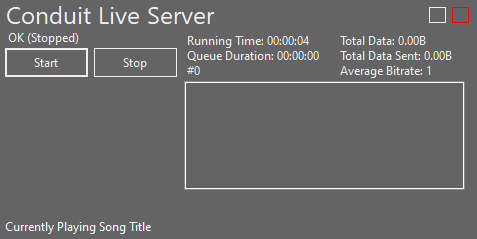

# App Usage
Not interested in using the libraries? No problem! We offer binary downloads in the Releases tab.

*Interested in the libraries? See [USAGE.MD](USAGE.md).*
## Client Usage

Simply replace `127.0.0.1` with the server host (e.g. `conduit.example.com` or `11.111.11.111`). If the host is not using the default port `32662`, replace it with the actual port.

Then, just hit `Connect`.

To make the window translucent, click the white square at the top-right.

To close the window, press the red square at the top-right.

To move the window, just click and drag on the text "Conduit Live Client."

To change the volume, click and drag the bar in the center of the player.

The bar on the left is the amount of data in the audio buffer. 

The bar to the right of that is the amount of data in the socket buffer.

There is no control to disconnect, so just reopen the client to connect to a new server.

## Server Usage

To start listening for clients, click `Start`.

To stop listening for clients, click `Stop`.

To disconnect a specific client, click on their IP in the list box.

To view the queue, click `View Queue`.

To clear the queue, click `Clear Queue`.

To request that all clients discard their buffers, click `Req. Clear`.

The red and white squares do the same thing as on the client (close and make transparent).

**To play a file, drag and drop it onto the Conduit Live Server window**.

Click the pink button at the bottom right to clear the queue.

The red and white squares do the same thing as on the client (close and make transparent).

---
That's all there is to it! These apps are mainly intended as a reference for how to integrate Conduit into an app, but feel free to make pull requests if you would like to implement some features 🙂